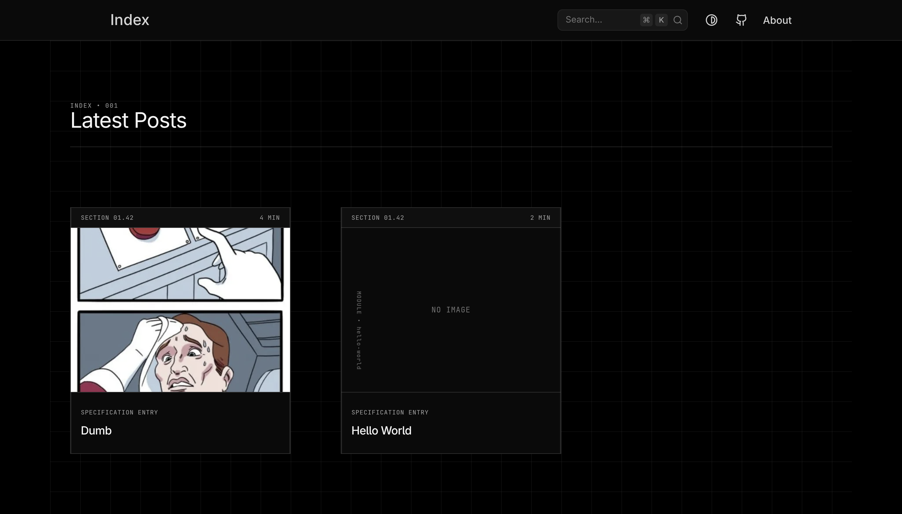
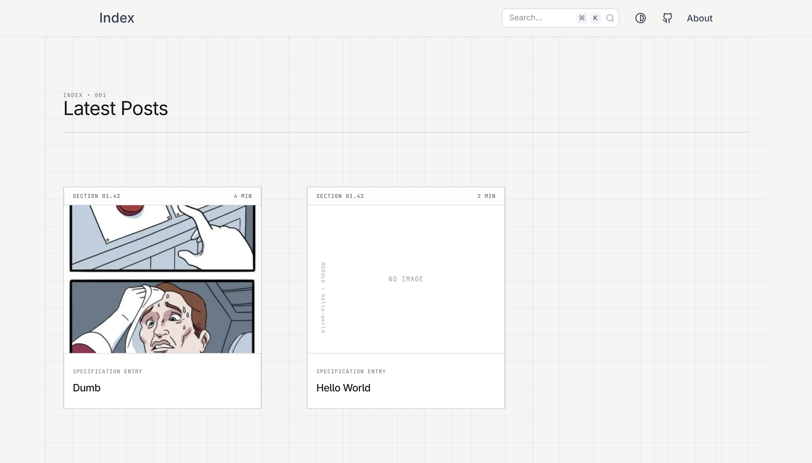
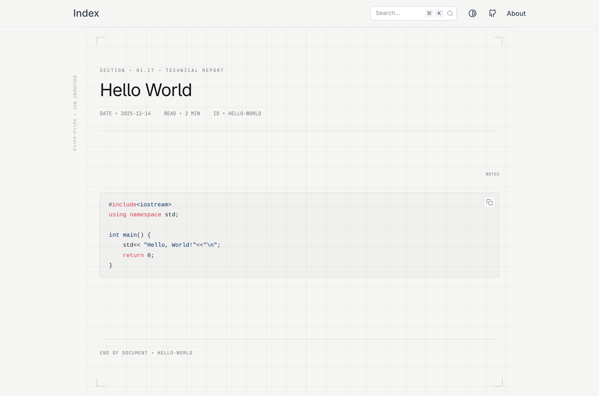
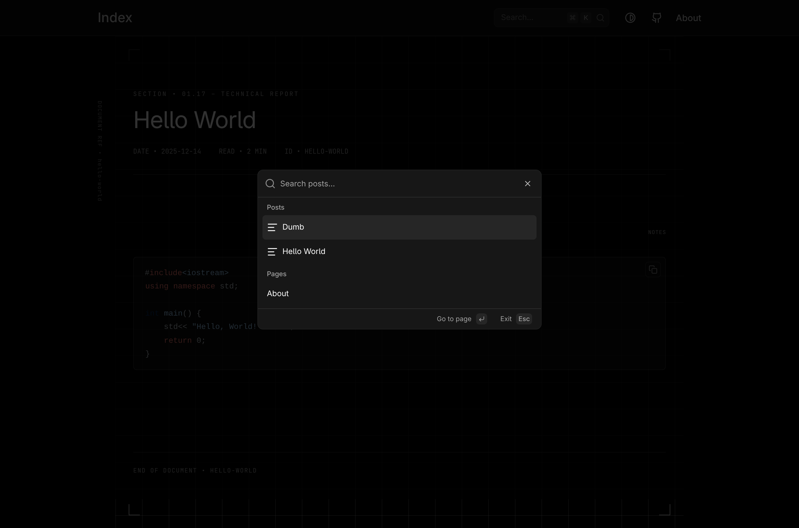

# Personal Blog

Notes from building and learning

## Exmaple

Below are a few snapshots of the blog UI and layout.

<!-- Horizontal comparison -->
<div style="display: flex; gap: 16px;">
  
  
</div>

<br />

<!-- Vertical showcase -->
<div style="display: flex; flex-direction: column; gap: 16px;">
  
  
</div>

## Installation

1. **Fork the repo**

2. **Clone your fork**

   ```bash
   git clone https://github.com/<username>/personal-blog.git
   ```

3. **Move to the project root directory**

   ```bash
   cd personal-blog
   ```

4. **Install dependencies**

   ```bash
   pnpm install
   ```

5. **Run the Project**

   ```bash
   pnpm dev
   ```

   Project should be running at `localhost:3000/`
